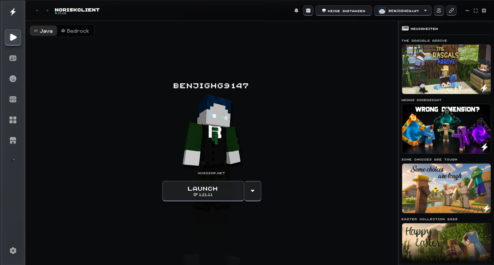
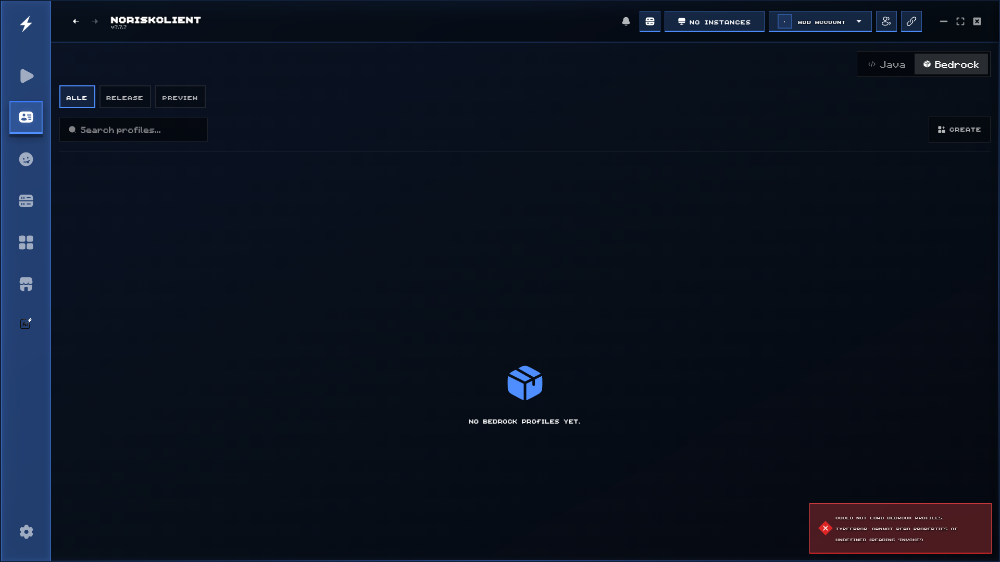
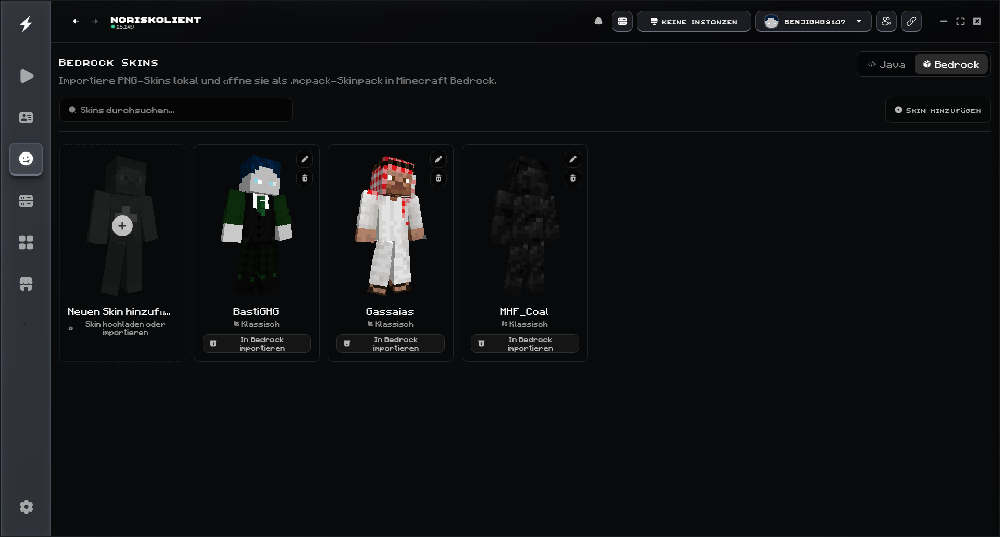
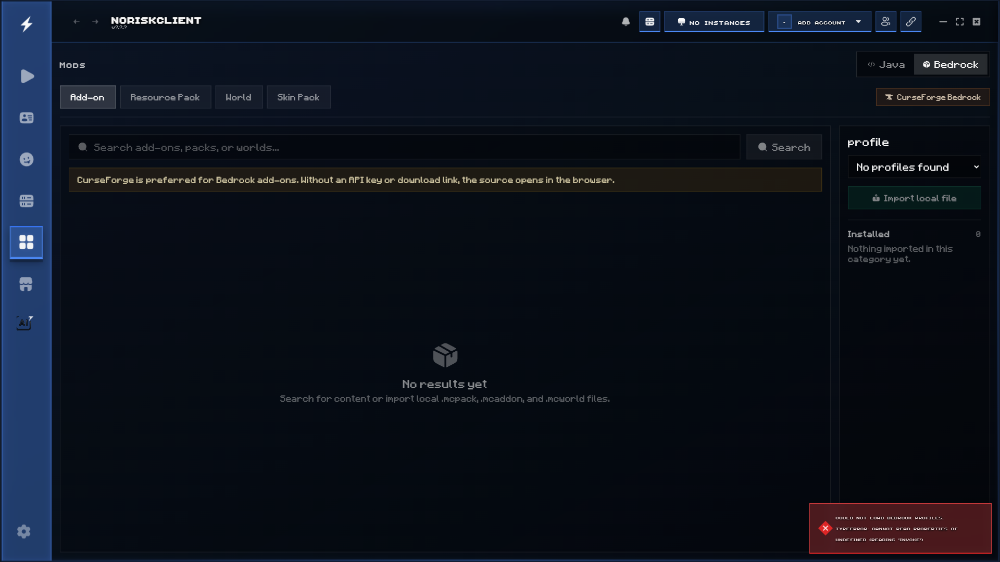
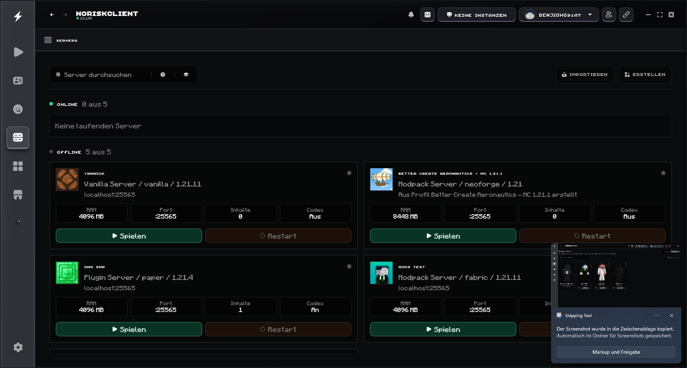
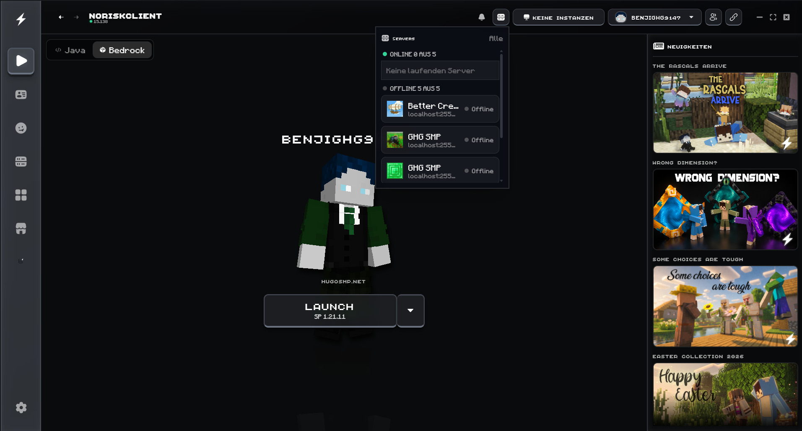
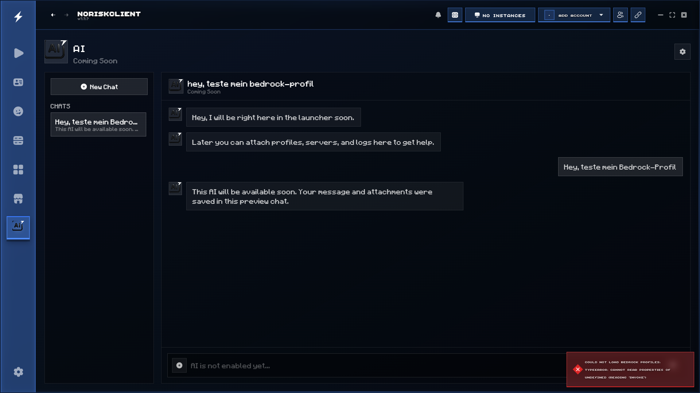
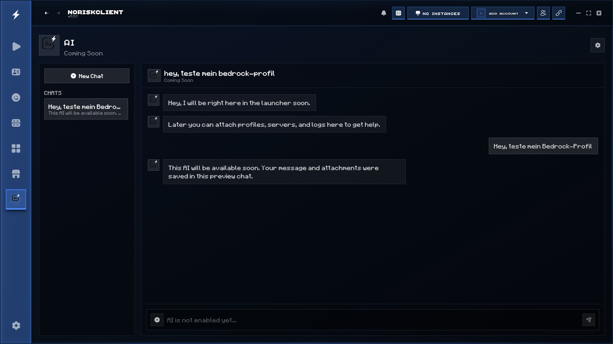

# NoRisk Update Ideas

This prototype extends the launcher with local Minecraft server hosting, practical Bedrock workflows, and an AI chat preview while preserving the existing Java launcher experience.

## Bedrock launcher experience

- Java and Bedrock use the same launcher layout instead of showing a separate information page.
- Bedrock profiles can be created for Release or Preview, selected, launched, and deleted.
- The Play page uses the selected Bedrock profile together with the locally selected Bedrock skin.
- Running Bedrock Release and Preview processes appear in the instance indicator.

## Bedrock skins and content

- PNG skins can be stored in a local Bedrock skin library.
- The launcher creates a valid `.mcpack` skin pack and opens it with Minecraft Bedrock.
- Bedrock add-ons, resource packs, worlds, and skin packs can be imported locally.
- The content browser uses a Java-style catalog layout and supports CurseForge Bedrock search when an API key is configured.

## Local server hosting

- Local Java and Bedrock servers are managed directly in the launcher.
- Servers are grouped by online and offline state and are available from the header dropdown.
- Paper, Fabric, Forge, NeoForge, Vanilla, and Bedrock server workflows are represented by the local server engine.
- Server cards expose status, RAM, port, content count, launch, restart, settings, backups, files, users, and MCP integration.

## AI preview

- The supplied AI artwork is integrated into the navigation and chat header.
- Chats can be created and stored locally already.
- Users can type messages and receive a clear preview response while the real AI backend remains marked as Coming Soon.
- The attachment menu can select launcher profiles, local servers, and images.

## Validation

- `corepack yarn build`
- `corepack yarn tsc --noEmit`
- `cargo check --manifest-path src-tauri/Cargo.toml`
- `corepack yarn tauri build --no-bundle`
- Visual browser checks for Bedrock profiles, the Bedrock content browser, and the AI chat preview

The Windows release executable was also copied into the existing local NoRisk Launcher installation and launched successfully.
